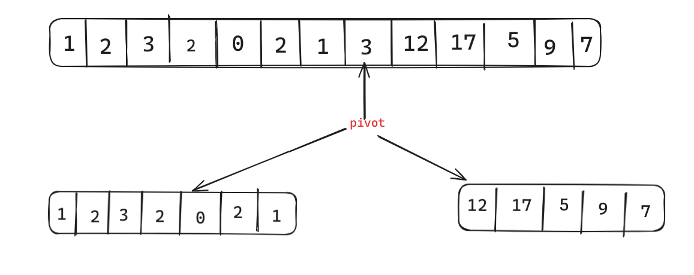

# Binary Search
Binary search is the divide and conquer algo, simply divide by half, and check, if the value is > the item being searched, we know that the value is not the item so we bump it up by one.
If the value is < the item being searched, we also know that the value is not the item so we bump it down by one.
hence the 
```rust
// if value > item
low = mid + 1;
// if item < value
high = mid - 1;
```

# Selection Sort
First sorting-algo with O(n^2), the book I'm reading through suggested to init a new Vec/List and append the smallest member from the read Vec/List to the new Vec/List.
I've changed it so that the selection sort function changes the Vec in place.
Honestly, borderline wrote C code.<br></br>
Explaining the loop,
```rust
for i in 0..length {
    for j in i..length {
        // logic
    }
}
```
- The first `i`-based for loop is to iterate the over the entire length of the array, we do this to ensure we are placing the smallest member in the first position, second smallest in the second position
and so on and so forth.

- The following `j`-based for loop is to iterate the remaining ***unsorted*** array, we know that at the end of the `j` loop we would have found the smallest member that is not placed into their
correct position. We iterate from `i` up, because we know that `i - 1` has been sorted in the previous iteration.

# Recursion

Honestly, it is pretty hard to grasp even for the simple ones like recursive_max and recursive_count, my logic very bad 

# Quicksort

This is a sorting algorithm that is much more understandable on paper with recursion. You have an array of elements, you'll have to choose one of the elements as a pivot, and then
partition the elements such that you have a set of elements < pivot and a set of elements > pivot.
It ends up looking something like this


The `qsort` is then done recursively on the lower-bound and upper-bound partitions.

All recursive problems can be solved iteratively. I plan to rewrite my qsort to be iterative. The book I was reading suggested using two new Vec/List to hold the upper&lower bounds.
For all algorithms in this book, I will be writing them in-place as to better my understanding and introduce a bit more challenge.

# Linked List
I'm not too sure if this was the intended way to write a Linked List? I just went with what I remembered/learnt from writing C by allocating the next node on the heap and storing the pointer
to it, in rust this would be the `Box` type, a simple smart(?) pointer for heap-allocation.
I used a lot of the built-in `Option` type's convenience method when writing this implementation, and its only a Singly-linked list, I'd imagine a doubly-linked list is much more annoying
to implement.
